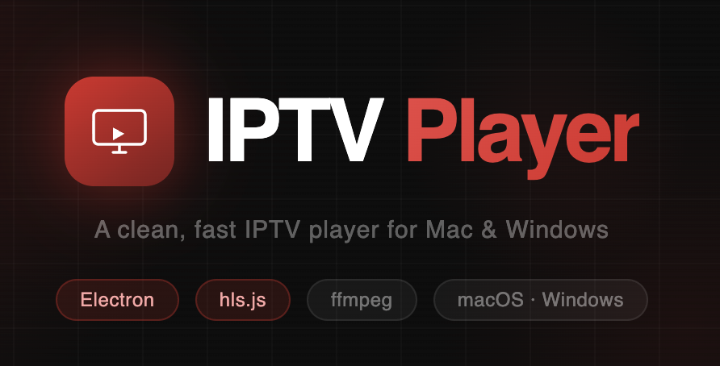

<div align="center">



**A clean, fast, native IPTV player for Mac and Windows**

Built with Electron · hls.js · ffmpeg

[](https://github.com)
[](https://github.com)
[](https://electronjs.org)
[](LICENSE)

</div>

---

## What it is

IPTV Player is a desktop app that loads any `.m3u` or `.m3u8` playlist and plays your streams with no fuss. It looks great, works fast, and stays out of your way.

- Browse hundreds of channels with instant search
- Group tabs auto-generated from your playlist
- Favorites synced across sessions
- VOD seek bar for movies and recorded content
- Keyboard shortcuts for everything
- Track info detection via ffprobe (audio/subtitle streams shown)

---

## Screenshots

> _Add screenshots here_

---

## Getting started

### Prerequisites

- [Node.js](https://nodejs.org) v18+
- [ffmpeg](https://ffmpeg.org) (Mac: `brew install ffmpeg`, Windows: [ffmpeg.org](https://ffmpeg.org/download.html))

### Install & run

```bash
git clone https://github.com/yourusername/iptv-player
cd iptv-player
npm install
npm start
```

### Build

**macOS**
```bash
npm run build
# Output: dist/IPTV Player-arm64.dmg  (M1/M2/M3)
#         dist/IPTV Player-x64.dmg    (Intel)
```

**Windows** (run PowerShell as Administrator)
```powershell
npm install
npx electron-builder --win
# Output: dist/IPTV Player Setup.exe
```

---

## Using IPTV Player

### Loading a playlist

On first launch, paste your M3U URL into the input field or click the folder icon to open a local `.m3u` file. Your playlist is saved and reloaded automatically on next launch.

### Controls

| Key | Action |
|-----|--------|
| `Space` / `K` | Play / Pause |
| `F` | Toggle fullscreen |
| `M` | Mute |
| `J` | Skip back 10s |
| `L` | Skip forward 10s |
| `←` / `→` | Volume down / up |
| `Shift + ←` | Previous channel |
| `Shift + →` | Next channel |

### Hover controls

Move your mouse over the player to reveal the control bar. From left to right:

- **Play/Pause** — or press `Space`
- **Stop** — return to the channel browser
- **Skip ±10s** — for VOD content
- **Volume** — slider + mute toggle
- **Now Playing** — current channel name
- **Status** — Live / Buffering / Paused
- **Fullscreen**

The seek bar appears above the controls for any stream with a known duration (VOD / recordings).

### Favorites

Click the ☆ star in the top bar while watching a channel to save it. Access your favorites from the **Favorites** tab in the side panel (hover to reveal).

---

## Tech stack

| Layer | Tech |
|-------|------|
| Shell | Electron 41 |
| Playback | hls.js + native HTML5 video |
| Stream probing | ffprobe (Homebrew / system) |
| Storage | Electron Store (JSON) |
| Build | electron-builder |

---

## Requirements

IPTV Player requires **ffmpeg installed on your system** for stream track detection (audio/subtitle info). Without it the player still works — track info just won't appear.

**Mac:** `brew install ffmpeg`  
**Windows:** Download from [ffmpeg.org](https://ffmpeg.org/download.html) and add to your PATH

---

## Project structure

```
iptv-player/
├── src/
│   ├── main.js        # Electron main process
│   ├── renderer.js    # UI logic
│   ├── index.html     # App shell
│   └── preload.js     # IPC bridge
├── assets/
│   └── icon.png
├── package.json
└── build.sh
```

---

## Contributing

Pull requests welcome. For major changes please open an issue first.

---

## License

MIT — do whatever you want with it.

---

<div align="center">
  <sub>Made with Electron, hls.js, and too much caffeine</sub>
</div>
